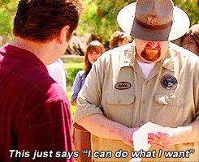

# TriviaGame
This simple game quizzes the user on trivia from NBC's Parks & Recreation. 

#### On load, a timer starts and each question/answer set appears: 

     start: function () {
        timer = setInterval(game.countdown, 1000);
        $("#sub-div").prepend("<h2>120 seconds left!</h2>");

        $("#start").remove();
        for (var i = 0; i < questions.length; i++) {
            $("#sub-div").append(" <h2>" + questions[i].question + "</h2>");
            for (var j = 0; j < questions[i].answers.length; j++) {
                $("#sub-div").append("<input type='radio' name='question-" + i + "' value='" + questions[i].answers[j] + "'> " + questions[i].answers[j] + " ");
            }
        }
        $("#sub-div").append("  <button type='button' class='btn btn-success' button id='end'>DONE</button>");
    },

#### As the user selects their answers, the game checks each of the user's guesses against the correct answer (behind the scenes): 
     
     $.each($("input[name='question-0']:checked"), function () {
            if ($(this).val() == questions[0].correctAnswer) {
                game.correct++;
            } else {
                game.incorrect++;
            }
        });
        
#### At the end, of if the time runs out, a new screen appears, showing the user their stats for correct and incorrect answers, along with their unanswered questions. 

     result: function () {
        clearInterval(timer);
        $("#sub-div h2").remove();

        $("#sub-div").html("<h2>All done!</h2> ");
        $("#sub-div").append("<h3>Correct Answers: " + this.correct + "</h3>");
        $("#sub-div").append("<h3>Incorrect Answers: " + this.incorrect + "</h3>");
        $("#sub-div").append("<h3>Unanswered: " + (questions.length - (this.incorrect + this.correct)) + "</h3> ");
        $("#sub-div").append("");

    }
